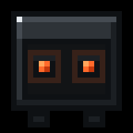

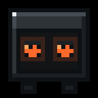

# vscode-pet-skins

Remplace le pet expérimental de VS Code par une mascotte personnalisée, et
documente le format pour que tu puisses dessiner la tienne.

Le skin fourni s'appelle **Nixie** — un écran d'ordinateur sur pieds, châssis
gris foncé, yeux rouge-orangé qui suivent le curseur. Nommé d'après les tubes
Nixie, ces afficheurs en verre sombre à lueur orange.

<p align="center">
  
  
  
</p>

<p align="center"></p>

Installation, désinstallation et réapplication après mise à jour sont
entièrement scriptées, en une commande. Le dépôt contient aussi la
**[spécification complète du format](SPRITE-SPEC.md)**, reconstituée par
lecture du bundle de VS Code — elle n'existe nulle part ailleurs.

---

## Sommaire

- [C'est quoi ce pet ?](#cest-quoi-ce-pet-)
- [Compatibilité](#compatibilité)
- [Installation](#installation)
- [Désinstallation](#désinstallation)
- [Après une mise à jour de VS Code](#après-une-mise-à-jour-de-vs-code)
- [Comment ça marche](#comment-ça-marche)
- [Créer son propre skin](#créer-son-propre-skin)
- [Dépannage](#dépannage)
- [Risques](#risques)

---

## C'est quoi ce pet ?

VS Code **1.131** (29 juillet 2026) a introduit une fonctionnalité marquée
*highly experimental* : une petite créature animée dans le panneau de chat,
invoquée par `/vscode-pet`. Elle réagit à ce que fait l'agent — frappe, rendu,
sommeil, applaudissements — et son regard suit la souris.

Microsoft n'expose **aucun réglage** pour la personnaliser. Un clic droit donne
accès à deux variantes de sprites et à un mode « on the run », c'est tout. Ce
dépôt remplace les assets et surcharge le CSS.

## Compatibilité

| | |
|---|---|
| VS Code | ≥ 1.131 — vérifié sur **1.132.0** |
| OS | Windows (scripts PowerShell) |
| Droits | administrateur si VS Code est dans `Program Files` |

Le format des sprites est identique partout ; seuls les scripts sont
spécifiques à Windows. Sur macOS et Linux les chemins sont respectivement
`Visual Studio Code.app/Contents/Resources/app/out` et
`/usr/share/code/resources/app/out`, les étapes sont les mêmes.

## Installation

```powershell
git clone https://github.com/Cvandeput/vscode-pet-skins.git
cd vscode-pet-skins
powershell -ExecutionPolicy Bypass -File .\scripts\Install-PetSkin.ps1
```

Le script s'élève tout seul (invite UAC), refuse de tourner si VS Code est
ouvert — `-Force` pour le fermer automatiquement — et sauvegarde tout avant
d'écrire.

Puis, dans VS Code, tape `/vscode-pet` dans le chat.

### Options

| Option | Effet |
|---|---|
| `-Skin <nom>` | choisit un sous-dossier de `skins\`. Défaut : `nixie` |
| `-Force` | ferme VS Code au lieu de s'arrêter |
| `-KeepBanner` | ne touche pas à `product.json` ; la bannière d'intégrité apparaîtra |
| `-RegisterLogonTask` | rejoue l'installation à chaque ouverture de session |
| `-VSCodeRoot <chemin>` | force la racine d'installation |
| `-SpriteDir` / `-CssFile` | surcharge ponctuelle des chemins |

## Désinstallation

```powershell
powershell -ExecutionPolicy Bypass -File .\scripts\Uninstall-PetSkin.ps1
```

Restaure les 48 sprites, `workbench.html` et `product.json` depuis la
sauvegarde la plus récente, vérifie chaque fichier par SHA-256, et supprime la
tâche planifiée si elle existe.

```powershell
.\scripts\Uninstall-PetSkin.ps1 -ListBackups
.\scripts\Uninstall-PetSkin.ps1 -Timestamp 2026-08-11_15-26-37
```

Sauvegardes dans `%USERPROFILE%\.vscode-pet-skin\backups\`.

## Après une mise à jour de VS Code

Une mise à jour réinstalle les fichiers d'origine : le skin disparaît. Relance
l'installateur, il re-résout le hash du nouveau build.

```powershell
powershell -ExecutionPolicy Bypass -File .\scripts\Install-PetSkin.ps1 -Force
```

Pour ne plus y penser :

```powershell
powershell -ExecutionPolicy Bypass -File .\scripts\Install-PetSkin.ps1 -RegisterLogonTask
```

Le script est idempotent : relancé alors que rien n'a changé, il ne casse ni ne
duplique quoi que ce soit.

## Comment ça marche

Trois couches, chacune indépendante et réversible.

**1. Les sprites.** 48 PNG remplacés dans
`resources\app\out\vs\workbench\contrib\chat\browser\widget\media\chatPet\`.
Ces fichiers ne figurent pas dans la liste `checksums` de `product.json` : les
remplacer seuls ne déclenche **aucun avertissement**.

**2. Le CSS.** Sur trois états (`idle`, `rendering`, `clapping`), VS Code
dessine les pupilles en DOM par-dessus le sprite — c'est ce qui leur permet de
suivre le curseur. Elles sont codées en dur en `#191a1b` et positionnées pour
l'ancien personnage. Un bloc `<style>` est injecté dans `workbench.html` pour
les repositionner sur les orbites du nouveau skin et les recolorer.

Ce dépôt patche `workbench.html` directement plutôt que de dépendre de
l'extension *Custom CSS and JS Loader* : même effet, entièrement scriptable,
sans étape manuelle.

**3. Le checksum.** `workbench.html`, lui, **est** checksummé. Le modifier
déclenche « Your Code installation appears corrupt » à chaque démarrage. Le
script recalcule le checksum et met `product.json` à jour, ce qui supprime la
bannière.

> Ce contrôle d'intégrité sert à détecter une altération non désirée de
> l'installation. Ici l'altération est volontaire, connue et réversible, donc
> le recalcul est cohérent — mais `-KeepBanner` saute cette étape si tu
> préfères garder l'avertissement.

## Créer son propre skin

```
skins/
└── nixie/
    ├── skin.json          métadonnées : palette, coordonnées des orbites
    ├── sprites/           les 48 PNG
    ├── css/pet.css        surcharges des pupilles
    ├── generator/         le script qui produit les sprites
    └── preview/           gifs et planche des états
```

Duplique `skins/nixie/` sous un autre nom, modifie, puis :

```powershell
.\scripts\Install-PetSkin.ps1 -Skin <ton-skin>
```

### Le générateur

Tout le dessin de Nixie est produit par
[`skins/nixie/generator/petgen.py`](skins/nixie/generator/petgen.py) — ~400
lignes de Python, sans dépendance hors Pillow. Aucun asset n'est dessiné à la
main.

```bash
pip install pillow
python skins/nixie/generator/petgen.py     # écrit out/ : 48 PNG + preview/
```

Structure : la palette dans un dict en tête de fichier, `draw_base()` pour le
châssis, une fonction par animation, l'assemblage des spritesheets à la fin.
Changer une couleur tient en une ligne ; redessiner le personnage tient dans
`draw_base()`.

### Avant de te lancer

Lis [**SPRITE-SPEC.md**](SPRITE-SPEC.md). Trois pièges y sont détaillés, et
aucun n'est visible sur une image fixe :

1. **Le nombre de frames est imposé** par des tables de durées codées en dur
   dans le JS. Une frame de trop et l'animation se désynchronise.
2. **Les états *tracking* ne doivent pas contenir de pupilles** — VS Code les
   dessine par-dessus. Un sprite avec des yeux peints y donnera quatre yeux.
3. **`idle` doit se synchroniser au frame près** avec les keyframes CSS :
   descente à la frame 20, clignement aux frames 23-27.

### Repositionner les yeux

Une cellule de la grille logique 24×24 vaut 2 px CSS :

```
orbite (x, y)  ->  left: x*2 px,  top: y*2 px
```

Reporte les valeurs dans `skins/<ton-skin>/css/pet.css` et dans `skin.json`.

## Dépannage

**Le pet est toujours l'ancien personnage.** Les PNG n'ont pas été copiés, ou
VS Code tournait pendant la copie. Relance avec `-Force`.

**L'écran est bien là mais les pupilles sont noires ou décalées.** Le bloc CSS
n'est pas pris. Vérifie que `workbench.html` contient `<!-- pet-skin:start -->`.
Si oui, c'est de la spécificité : ajoute `!important` sur les cinq déclarations
de `css/pet.css` et relance.

**Le pet a quatre yeux.** Des pupilles ont été dessinées dans les sprites
*tracking*. Voir la [section 5 de la spec](SPRITE-SPEC.md).

**Le visage se décolle du corps en animation.** Le palier de `idle` n'est pas à
la bonne frame. Voir la [section 7](SPRITE-SPEC.md).

**« Your Code installation appears corrupt ».** Checksum non mis à jour : soit
`-KeepBanner`, soit la clé est absente de `product.json`.

**Le pet n'apparaît pas.** Tape `/vscode-pet` dans le chat. Demande VS Code
≥ 1.131.

## Risques

Ce dépôt modifie les fichiers d'installation de VS Code. Rien n'est
irréversible, mais autant savoir ce qu'on fait.

- Tout est sauvegardé avec un manifeste SHA-256 avant la première écriture.
- Les sprites seuls ne déclenchent aucun avertissement d'intégrité.
- Le patch `workbench.html` + `product.json` en déclenche un, contourné par
  recalcul du checksum.
- Une mise à jour de VS Code écrase les modifications, sans casse.
- Rien ne touche aux réglages, extensions, ni données utilisateur.

`/vscode-pet` est marqué *highly experimental* par Microsoft. Noms de fichiers,
classes CSS et compteurs de frames peuvent changer d'une version à l'autre,
voire disparaître.

## Contribuer

Les skins sont bienvenus. Un skin = un dossier sous `skins/`, avec les 48 PNG,
un `skin.json`, un `pet.css` et de quoi le régénérer. Ouvre une PR avec une
capture.

## Licence

MIT. Les sprites de ce dépôt sont des créations originales ; ceux d'origine
appartiennent à Microsoft et ne sont pas redistribués ici.

