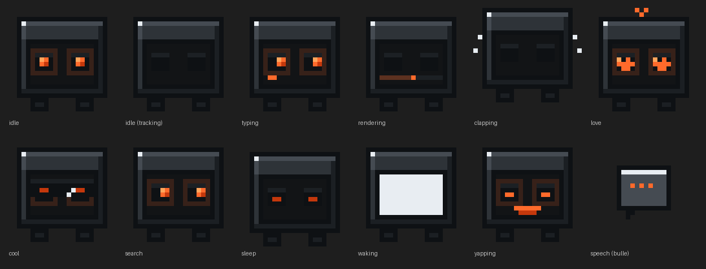
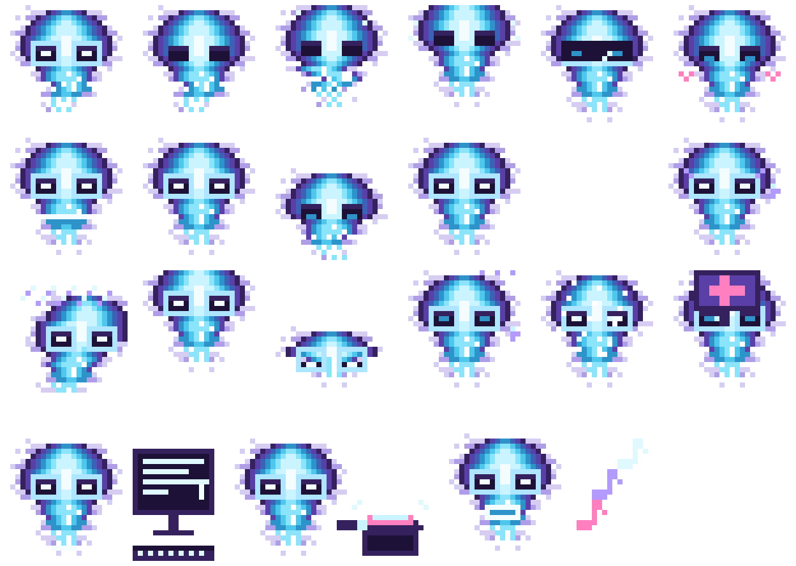
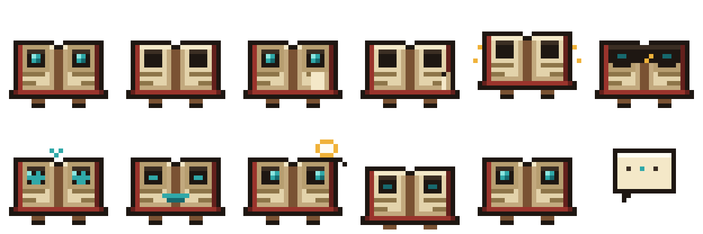

# vscode-pet-skins

Remplace le pet expérimental de VS Code par une mascotte personnalisée, et
documente le format pour que tu puisses dessiner la tienne.

Trois skins sont fournis — **Nixie**, **Vapor** et **Codex** — mais l'essentiel
du dépôt est ailleurs : un générateur qui dérive les 249 frames imposées par
VS Code à partir d'un seul fichier de description, et la
**[spécification complète du format](SPRITE-SPEC.md)**, reconstituée par
lecture du bundle — elle n'existe nulle part ailleurs.

<p align="center"></p>

---

## Installation en une ligne

```powershell
irm https://raw.githubusercontent.com/Cvandeput/vscode-pet-skins/main/install.ps1 | iex
```

> **Ce script modifie ton installation de VS Code et demande une élévation
> (invite UAC).** Il remplace 82 fichiers PNG, injecte un bloc `<style>` dans
> `workbench.html` et recalcule un checksum dans `product.json`. Tout est
> sauvegardé avant écriture et réversible par `Uninstall-PetSkin.ps1` — mais
> ce sont bien des fichiers de programme qui sont réécrits. Si tu préfères
> voir ce qui va s'exécuter, ouvre
> [`install.ps1`](install.ps1) d'abord ; il tient en une page.

Le script clone le dépôt dans `%LOCALAPPDATA%\vscode-pet-skins`, puis enchaîne
sur l'installateur. Réglable par variables d'environnement :

| Variable | Effet | Défaut |
|---|---|---|
| `PETSKIN_SKIN` | skin à installer | `nixie` |
| `PETSKIN_DIR` | dossier de clone | `%LOCALAPPDATA%\vscode-pet-skins` |
| `PETSKIN_REF` | branche ou tag | `main` |
| `PETSKIN_ARGS` | arguments passés à `Install-PetSkin.ps1` | — |
| `PETSKIN_YES` | `1` supprime la temporisation d'avertissement | — |

```powershell
$env:PETSKIN_SKIN='codex'; irm https://raw.githubusercontent.com/Cvandeput/vscode-pet-skins/main/install.ps1 | iex
```

Puis, dans VS Code, tape `/vscode-pet` dans le chat.

---

## Ça cassera à la prochaine mise à jour de VS Code

Autant le dire tout de suite : **ce dépôt suit une fonctionnalité que Microsoft
remanie encore**, et chaque mise à jour de VS Code peut le casser.

Ce n'est pas une crainte théorique, c'est déjà arrivé. Entre la **1.132** et la
**1.133**, le pet est passé de 12 à 21 états, `typing` de 8 frames à 2, et la
frame a cessé d'être carrée : les états à accessoire sont désormais plus larges
(`typing` 168×96, `press-button` 160×96) et `sing` est plus haute (164×124).
Neuf états sont apparus — `falling`, `jump`, `press-button`, `respawn`,
`revive-sign`, `sing`, `speechless`, `splat`, `worry` — signe qu'un petit jeu
s'est greffé sur la mascotte.

**Le dépôt cible aujourd'hui la 1.133.0, et rien d'autre.** Viser plusieurs
versions à la fois coûterait plus que de suivre la dernière. Je regarde à
chaque sortie de VS Code et je mets à jour.

Ce qui rend ce suivi tenable, c'est que **le format est une donnée, pas du
code** : `schema/formats/1.133.json` décrit état par état le nom de fichier, le
nombre de frames, la taille de frame et la présence d'une spritesheet. Après
une mise à jour, la remise à niveau tient en trois commandes :

```bash
python tools/probe_format.py --out schema/formats/<nouvelle-version>.json
python generator/petgen.py
python tools/check_skins.py
```

`probe_format.py` lit l'installation de VS Code et en déduit le format ; le
générateur s'y conforme. Il ne reste à dessiner que les états réellement
nouveaux.

Si tu installes le skin sur une version non relevée, l'installateur **refuse
d'écrire** plutôt que de produire un pet incohérent, et te dit quelle commande
lancer. Rien n'est cassé, rien n'est à réparer à la main.

---

## Sommaire

- [Ça cassera à la prochaine mise à jour](#ça-cassera-à-la-prochaine-mise-à-jour-de-vs-code)
- [Les trois personnages](#les-trois-personnages)
- [C'est quoi ce pet ?](#cest-quoi-ce-pet-)
- [Compatibilité](#compatibilité)
- [Installation depuis le dépôt](#installation-depuis-le-dépôt)
- [Désinstallation](#désinstallation)
- [Après une mise à jour de VS Code](#après-une-mise-à-jour-de-vs-code)
- [Comment ça marche](#comment-ça-marche)
- [Créer son propre skin](#créer-son-propre-skin)
- [Intégration continue](#intégration-continue)
- [Dépannage](#dépannage)
- [Risques](#risques)

---

## Les trois personnages

```powershell
.\scripts\Install-PetSkin.ps1 -List      # nom, auteur, versions vérifiées
```

### Nixie

Un écran d'ordinateur sur pieds, châssis gris foncé, yeux rouge-orangé qui
suivent le curseur. Nommé d'après les tubes Nixie, ces afficheurs en verre
sombre à lueur orange. Sa dalle scintille, s'éteint quand il dort et se
rallume par un amorçage CRT.

<p align="center"></p>
<p align="center"></p>

### Vapor

Une entité flottante — **sans pieds et sans écran**. Une flamme spectrale à la
tête large, qui s'effile vers le bas et s'y dissipe, cernée d'un halo diffus.
Palette froide, du blanc du cœur au violet sombre des bords, deux yeux en
fente lumineuse. Il ne touche jamais le sol : au repos il flotte et son bas
ondule ; pour dormir il se pose et se tasse, au réveil il se regonfle.

<p align="center"></p>
<p align="center"></p>

### Codex

Un petit livre ouvert, large et bas : deux pages de parchemin de part et
d'autre d'une reliure de cuir rouge, un œil d'encre turquoise sur chaque page,
deux pattes courtes sous la couverture. Il tourne ses pages quand tu tapes,
les fait défiler vite pendant un rendu, et sort une loupe quand il cherche.
C'est le seul des trois à garder la **bulle de dialogue** activée.

<p align="center"></p>
<p align="center"></p>

---

## C'est quoi ce pet ?

VS Code **1.131** (29 juillet 2026) a introduit une fonctionnalité marquée
*highly experimental* : une petite créature animée dans le panneau de chat,
invoquée par `/vscode-pet`. Elle réagit à ce que fait l'agent — frappe, rendu,
sommeil, applaudissements — et son regard suit la souris.

Microsoft n'expose **aucun réglage** pour la personnaliser. Un clic droit donne
accès à deux variantes de sprites et à un mode « on the run », c'est tout. Ce
dépôt remplace les assets et surcharge le CSS.

## Compatibilité

| | |
|---|---|
| VS Code | **1.133.0** — la seule version supportée, voir ci-dessous |
| OS | Windows (scripts PowerShell) |
| Droits | administrateur si VS Code est dans `Program Files` |

Le format des sprites est identique partout ; seuls les scripts sont
spécifiques à Windows. Sur macOS et Linux les chemins sont respectivement
`Visual Studio Code.app/Contents/Resources/app/out` et
`/usr/share/code/resources/app/out`, les étapes sont les mêmes.

## Installation depuis le dépôt

```powershell
git clone https://github.com/Cvandeput/vscode-pet-skins.git
cd vscode-pet-skins
powershell -ExecutionPolicy Bypass -File .\scripts\Install-PetSkin.ps1 -Skin codex
```

Le script s'élève tout seul (invite UAC), refuse de tourner si VS Code est
ouvert — `-Force` pour le fermer automatiquement — et sauvegarde tout avant
d'écrire. Il **attend** la fin de la session élevée et propage son code de
sortie ; comme la fenêtre élevée se referme aussitôt, elle est journalisée
dans `%USERPROFILE%\.vscode-pet-skin\last-run.log`, dont les dernières lignes
sont affichées en cas d'échec.

### Options

| Option | Effet |
|---|---|
| `-List` | liste les skins disponibles avec auteur et versions vérifiées, puis sort. N'exige aucune élévation |
| `-Skin <nom>` | choisit un sous-dossier de `skins\`. Non fourni, le dernier skin installé est relu dans `state.json` (défaut `nixie`) |
| `-KeepBackups <n>` | nombre de sauvegardes conservées, les plus anciennes sont purgées. Défaut `5`, `0` = illimité. Les sauvegardes d'origine échappent au quota |
| `-Force` | ferme VS Code au lieu de s'arrêter |
| `-KeepBanner` | ne touche pas à `product.json` ; la bannière d'intégrité apparaîtra |
| `-RegisterLogonTask` | rejoue l'installation à chaque ouverture de session |
| `-VSCodeRoot <chemin>` | force la racine d'installation |
| `-SpriteDir` / `-CssFile` | surcharge ponctuelle des chemins |

**Le script ne fait rien s'il n'y a rien à faire.** Si les 82 sprites cibles
sont déjà identiques aux sources et que le marqueur `<!-- pet-skin:start -->`
est dans `workbench.html`, il l'annonce et sort — sans sauvegarde et sans
écriture. C'est ce qui rend la tâche planifiée supportable : relancée à chaque
ouverture de session, elle ne crée plus une sauvegarde complète à chaque fois.

## Désinstallation

```powershell
powershell -ExecutionPolicy Bypass -File .\scripts\Uninstall-PetSkin.ps1
```

Restaure les 82 sprites, `workbench.html` et `product.json`, vérifie chaque
fichier par SHA-256, et supprime la tâche planifiée si elle existe.

Par défaut, c'est la sauvegarde **d'origine** qui est restaurée — celle prise
avant qu'un skin ne soit posé, la seule à contenir le pet de Microsoft. La
sauvegarde la plus récente, elle, peut ne contenir qu'un skin précédent si tu
en as changé. Pour la même raison, `-KeepBackups` ne purge jamais les
sauvegardes d'origine, quel que soit le quota.

```powershell
.\scripts\Uninstall-PetSkin.ps1 -ListBackups
.\scripts\Uninstall-PetSkin.ps1 -Timestamp 2026-08-11_15-26-37
```

Sauvegardes dans `%USERPROFILE%\.vscode-pet-skin\backups\`.

Si VS Code a été mis à jour entre-temps, la sauvegarde pointe sur un build qui
n'existe plus. Le script le détecte, explique que la mise à jour a déjà
restauré les fichiers d'origine, supprime la tâche planifiée et sort
normalement.

## Après une mise à jour de VS Code

Une mise à jour réinstalle les fichiers d'origine : le skin disparaît. Relance
l'installateur, il re-résout le build courant.

```powershell
powershell -ExecutionPolicy Bypass -File .\scripts\Install-PetSkin.ps1 -Force
```

Pour ne plus y penser :

```powershell
powershell -ExecutionPolicy Bypass -File .\scripts\Install-PetSkin.ps1 -RegisterLogonTask
```

La tâche ne fige pas le nom du skin : elle relit `state.json` à chaque
exécution, donc changer de skin ne demande pas de la réenregistrer.

Le build cible n'est pas choisi par date de modification — plusieurs dossiers
de hash coexistent après des mises à jour, et le plus récemment écrit n'est pas
forcément celui qu'exécute `Code.exe`. Il est résolu par la clé `commit` de
`resources\app\product.json`, recoupée avec la sortie de `Code.exe --version`.
Le tri par date reste en dernier recours, avec un avertissement.

## Comment ça marche

Trois couches, chacune indépendante et réversible.

**1. Les sprites.** 82 PNG remplacés dans
`resources\app\out\vs\workbench\contrib\chat\browser\widget\media\chatPet\`.
Ces fichiers ne figurent pas dans la liste `checksums` de `product.json` : les
remplacer seuls ne déclenche **aucun avertissement**.

**2. Le CSS.** Sur trois états (`idle`, `rendering`, `clapping`), VS Code
dessine les pupilles en DOM par-dessus le sprite — c'est ce qui leur permet de
suivre le curseur. Elles sont codées en dur en `#191a1b` et positionnées pour
l'ancien personnage. Un bloc `<style>` est injecté dans `workbench.html` pour
les repositionner sur les orbites du nouveau skin et les recolorer.

Ce dépôt patche `workbench.html` directement plutôt que de dépendre de
l'extension *Custom CSS and JS Loader* : même effet, entièrement scriptable,
sans étape manuelle.

**3. Le checksum.** `workbench.html`, lui, **est** checksummé. Le modifier
déclenche « Your Code installation appears corrupt » à chaque démarrage. Le
script recalcule le checksum et met `product.json` à jour, ce qui supprime la
bannière.

> Ce contrôle d'intégrité sert à détecter une altération non désirée de
> l'installation. Ici l'altération est volontaire, connue et réversible, donc
> le recalcul est cohérent — mais `-KeepBanner` saute cette étape si tu
> préfères garder l'avertissement.

## Créer son propre skin

```
generator/
├── petgen.py             lit skin.json, écrit les 82 PNG et pet.css
└── preview.py            bannière animée et planche des états
schema/skin.schema.json   le format, versionné — validé en CI
tools/
├── editor.html           éditeur pixel-art, à ouvrir dans le navigateur
└── check_skins.py        les contrôles de conformité, en local
skins/
└── nixie/
    ├── skin.json         LE fichier source : dessin, palette, repères, animations
    ├── sprites/          les 82 PNG produits
    ├── css/pet.css       généré, ne pas éditer à la main
    └── preview/          bannière, planche des états, gifs
```

### Le tout en trois étapes

**1. Dessine.** Ouvre [`tools/editor.html`](tools/editor.html) dans ton
navigateur — aucune installation, c'est un fichier unique. Tu y dessines le
personnage sur une grille 24×24, tu choisis tes couleurs, tu places les
repères, et tu exportes un `skin.json`.

L'éditeur montre en direct l'animation `idle` telle qu'elle sera rendue, à la
taille réelle de 48 px, avec un mode *tracking* où la pupille suit ta souris
comme dans VS Code. Il signale les incohérences de géométrie.

Outils : crayon, gomme, pot de peinture, pipette, symétrie horizontale,
annulation. Raccourcis `b` `e` `g` `i` et `Ctrl+Z`.

**2. Génère.**

```bash
pip install pillow
mkdir -p skins/<ton-skin> && mv ~/Downloads/skin.json skins/<ton-skin>/
python generator/petgen.py <ton-skin>      # 82 PNG + css/pet.css
python generator/preview.py <ton-skin>     # bannière et planche des états
python tools/check_skins.py <ton-skin>     # les contrôles de la CI, en local
```

`python generator/petgen.py` sans argument régénère **tous** les skins.

**3. Installe.**

```powershell
.\scripts\Install-PetSkin.ps1 -Skin <ton-skin>
```

### Le générateur est un interpréteur

`petgen.py` ne contient aucun dessin **et aucune hypothèse sur la morphologie
du personnage**. Tout vient de `skin.json`. Chaque animation y est décrite de
l'une des deux façons :

```jsonc
// une primitive, paramétrée
"typing": { "builtin": "pages", "params": { "rect": [4, 14, 19, 19], "turns": 1 } },

// ou la liste explicite des frames, au même format que `base`
"cool": { "frames": [ ["........", "..AABB.."], ["........", "..BBAA.."] ] }
```

Les primitives disponibles : `idle`, `float`, `rendering`, `clapping`, `cool`,
`sleep`, `waking`, `typing`, `love`, `yapping`, `search`, `speech`, `pages`,
plus `still` et `blank`. **N'importe laquelle peut occuper n'importe quel
slot** — `codex` met `pages` sur `typing` et `rendering`, `vapor` met `float`
sur `idle` et `rendering`. Les paramètres de chacune sont documentés dans les
docstrings des fonctions `bi_*` de
[`generator/petgen.py`](generator/petgen.py).

Elles dégradent proprement quand un repère manque : `anchors.feet` vide
(personnage flottant, cas de `vapor`) ne plante pas, `anchors.screen` absent
non plus — la zone d'écran est alors dérivée du corps. Un rôle de palette non
défini désactive l'effet qui s'en sert, sans erreur.

Les repères de `skin.json` disent au générateur **où** agir : `screen` délimite
la zone où dessiner scanlines et barres, `eyes` place les orbites, `feet`
identifie les pieds pour qu'ils puissent se lever, `body` sert aux effets qui
débordent, `mouth` et `bubble` positionnent la bouche et la bulle.

### L'option `speechBubble`

L'état `speech` ne dessine pas le personnage : il dessine **la bulle de
dialogue**. VS Code répète cette animation en boucle tant que l'état dure — une
bulle qui grossit sur les premières frames se dégonfle et se regonfle donc
indéfiniment. Le générateur la dessine à sa taille définitive dès la frame 0 ;
seuls les trois points s'animent, sur un cycle qui boucle proprement.

Un skin peut aussi ne pas vouloir de bulle du tout :

```json
"speechBubble": false
```

Les 6 frames deviennent entièrement transparentes et VS Code n'affiche rien.
Le code de la bulle reste disponible, l'option se rebascule sans rien
redessiner. Ici, `nixie` et `vapor` sont à `false`, `codex` à `true`.

### `pet.css` est généré

`css/pet.css` n'est pas à éditer : `petgen.py` le dérive de `skin.json`
(`roles.eyeCore` pour la couleur, `anchors.eyes` pour les coordonnées et la
taille des orbites). Une seule source de vérité, et la CI vérifie qu'une
régénération ne produit aucun diff.

### Avant de te lancer

Lis [**SPRITE-SPEC.md**](SPRITE-SPEC.md). Quatre pièges y sont détaillés, et
aucun n'est visible sur une image fixe :

1. **Le nombre de frames est imposé** par des tables de durées codées en dur
   dans le JS. Une frame de trop et l'animation se désynchronise.
2. **Les états *tracking* ne doivent pas contenir de pupilles** — VS Code les
   dessine par-dessus. Un sprite avec des yeux peints y donnera quatre yeux.
3. **`idle` doit se synchroniser au frame près** avec les keyframes CSS :
   descente à la frame 20, clignement aux frames 23-27.
4. **`speech` boucle à l'infini** : aucune frame ne doit représenter une phase
   d'apparition.

## Intégration continue

`.github/workflows/ci.yml`, sur push et PR :

- tous les `.ps1` commencent par le BOM UTF-8 `EF BB BF` — sans lui, Windows
  PowerShell 5.1 les lit en cp1252 et casse au premier accent dans une chaîne.
  C'est le test qui aurait attrapé le bug ;
- analyse syntaxique et `PSScriptAnalyzer` sans erreur ;
- chaque `skins/*/skin.json` validé contre
  [`schema/skin.schema.json`](schema/skin.schema.json) ;
- les 82 sprites : noms complets, et pour chaque état la taille de frame et le
  nombre de frames annoncés par `schema/formats/1.133.json` ;
- **régénération de tous les skins, puis `git diff --exit-code`** : les PNG et
  les `pet.css` commités doivent être exactement ceux que produit le générateur.

Les mêmes contrôles en local : `python tools/check_skins.py`.

## Dépannage

**Le pet est toujours l'ancien personnage.** Les PNG n'ont pas été copiés, ou
VS Code tournait pendant la copie. Relance avec `-Force`.

**L'écran est bien là mais les pupilles sont noires ou décalées.** Le bloc CSS
n'est pas pris. Vérifie que `workbench.html` contient `<!-- pet-skin:start -->`.
Si oui : soit une **Content-Security-Policy** restrictive neutralise le
`<style>` — l'installateur t'avertit quand il en détecte une —, soit c'est de
la spécificité, et il faut ajouter `!important` aux déclarations de
`css/pet.css`.

**Le pet a quatre yeux.** Des pupilles ont été dessinées dans les sprites
*tracking*. Voir la [section 5 de la spec](SPRITE-SPEC.md).

**Le visage se décolle du corps en animation.** Le palier de `idle` n'est pas à
la bonne frame. Voir la [section 7](SPRITE-SPEC.md).

**La bulle de dialogue pulse sans arrêt.** Une frame de `speech` dessine la
bulle plus petite qu'une autre. Voir la [section 10](SPRITE-SPEC.md).

**« Your Code installation appears corrupt ».** Checksum non mis à jour : soit
`-KeepBanner`, soit la clé est absente de `product.json`.

**L'installateur avertit que le skin n'est pas vérifié sur ma version.**
`verifiedOn` de `skin.json` ne liste pas la version installée. Ce n'est qu'un
avertissement : les compteurs de frames peuvent avoir changé, vérifie le rendu.

**Le pet n'apparaît pas.** Tape `/vscode-pet` dans le chat. Demande VS Code
≥ 1.131 ; le skin, lui, vise la 1.133.

## Risques

Ce dépôt modifie les fichiers d'installation de VS Code. Rien n'est
irréversible, mais autant savoir ce qu'on fait.

- Tout est sauvegardé avant la première écriture, et vérifié par SHA-256.
- Les sprites seuls ne déclenchent aucun avertissement d'intégrité.
- Le patch `workbench.html` + `product.json` en déclenche un, contourné par
  recalcul du checksum.
- Une mise à jour de VS Code écrase les modifications, sans casse.
- Rien ne touche aux réglages, extensions, ni données utilisateur.

`/vscode-pet` est marqué *highly experimental* par Microsoft. Noms de fichiers,
classes CSS et compteurs de frames changent d'une version à l'autre — c'est
déjà arrivé entre la 1.132 et la 1.133 — et la fonctionnalité peut disparaître.
Voir [Ça cassera à la prochaine mise à jour](#ça-cassera-à-la-prochaine-mise-à-jour-de-vs-code).

## Contribuer

Les skins sont bienvenus. Un skin = un dossier sous `skins/` avec un
`skin.json`, les 82 PNG et le `pet.css` régénérés par `generator/petgen.py`, et
des previews. La CI refusera la PR si la régénération produit un diff, si le
`skin.json` ne valide pas contre le schéma, ou si un compteur de frames est
faux. Ouvre une PR avec une capture.

## Licence

MIT. Les sprites de ce dépôt sont des créations originales ; ceux d'origine
appartiennent à Microsoft et ne sont pas redistribués ici.
